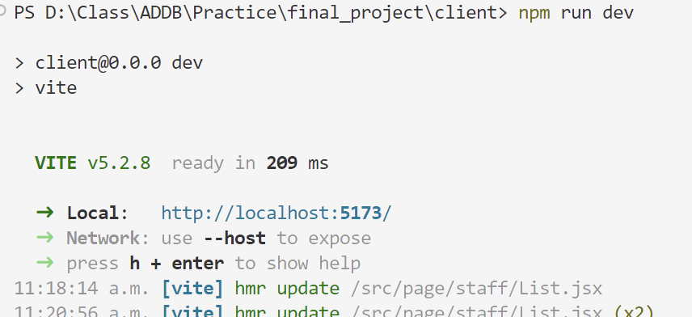

# Dream Home Front End

## Usage

Before you begin, ensure you have met the following requirements:

- Node.js installed on your machine
- npm or yarn package manager installed
- Dream Home backend API is running

### Installation

1. Navigate to the project directory:

    ```bash
    cd REACT-dream-home
    ```

2. Install dependencies using npm or yarn:

    ```bash
    npm install
    ```

### Development

To start the development server:

```bash
npm run dev
```

Click the link displayed in the command line.

``` console
-> Local:   http://localhost:5173/
```


